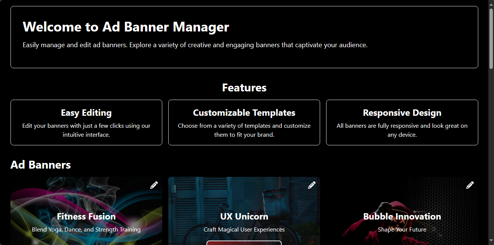
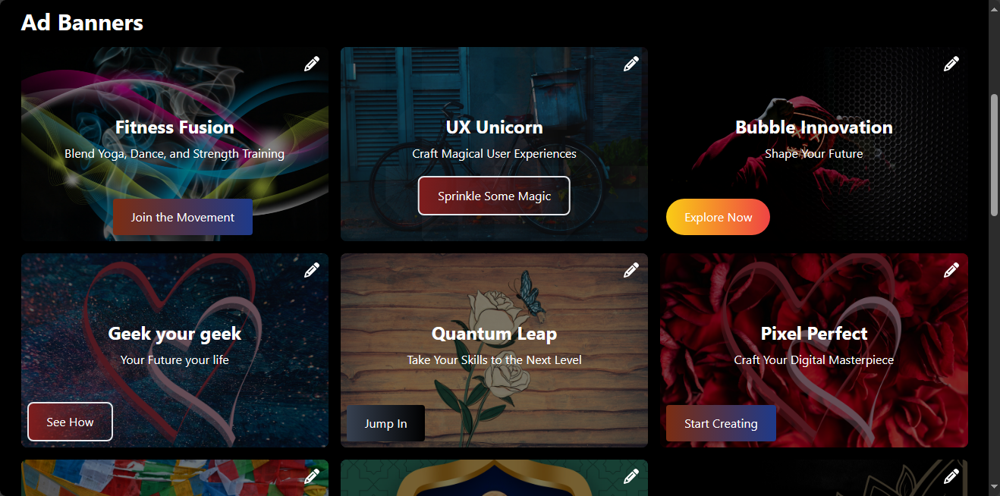

This is a [Next.js](https://nextjs.org/) project bootstrapped with [`create-next-app`](https://github.com/vercel/next.js/tree/canary/packages/create-next-app).

# Ad Banner Manager

Easily manage and edit ad banners. Explore a variety of creative and engaging banners that captivate your audience.



## Features

- **Easy Editing**: Edit your banners with just a few clicks using our intuitive interface.
- **Customizable Templates**: Choose from a variety of templates and customize them to fit your brand.
- **Responsive Design**: All banners are fully responsive and look great on any device.

## Ad Banners




## Getting Started

First, run the development server:

```bash
npm run dev
# or
yarn dev
# or
pnpm dev
# or
bun dev
```

